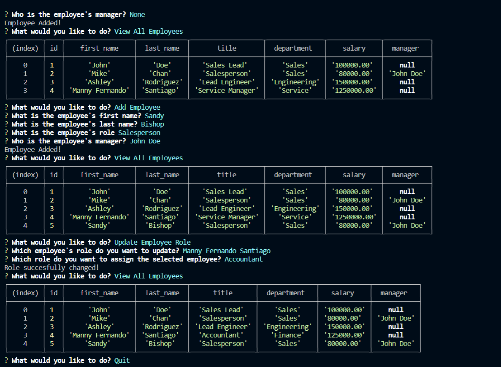

# Hw12-EmployeeTracker

### This is Mikhail Sookwah's of creating and employee tracker

This program includes: the

* A program that gives you a list of options for storing of viewing data in the database

    * You can view information about each employee, including their roles, what department each role belongs to, and if that employee works under a manger

    * You can view a list of role, and what department they belong to

    * You can view a list of Departments

    * You are also able to add new departments, roles that belongs to each department and employees that works under a role and/or manager

    * You can also change what role an employee belongs to

----------------------------------------------------------------

[Link to the website](https://github.com/Mikhail25/Hw12-EmployeeTracker)

[Link to the instruction video](https://drive.google.com/file/d/14MuF3uHWf6Gy9I9Eb36koxUMdqgBfM_L/view)